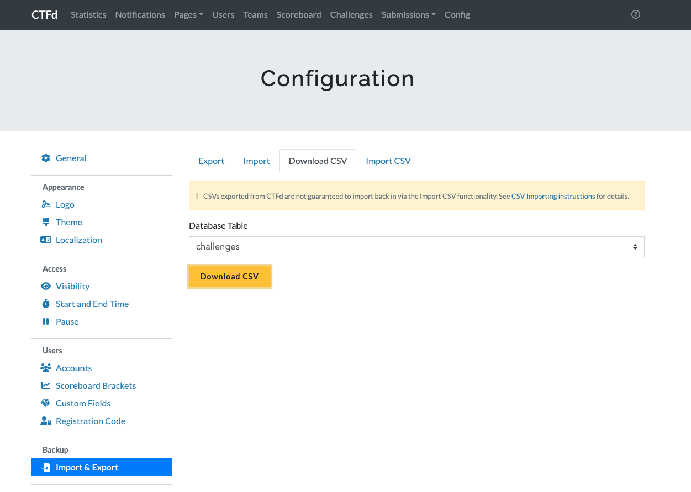

[](https://github.com/diver-osint-ctf/GenChallResult/actions/workflows/test.yaml)

# GenChallResult

Writeupのために、3種類の形式で問題情報を出力するスクリプト

```md
## OSINT

### テスト問題 (500pt / 1 solves)

### テスト問題2 (530pt / 0 solves)

## Web

### テスト問題3 (510pt / 0 solves)
```

```md
| ID | Name        | Genre | Score | Solver |
| -- | ----------- | ----- | ----- | ------ |
| 1  | テスト問題  | OSINT | 500   | 1      |
| 2  | テスト問題2 | OSINT | 530   | 0      |
| 3  | テスト問題3 | Web   | 510   | 0      |
```

```json
{
  "1": { "name": "テスト問題", "genre": "OSINT", "score": 500, "solver": 1 },
  "2": { "name": "テスト問題2", "genre": "OSINT", "score": 530, "solver": 0 },
  "3": { "name": "テスト問題3", "genre": "Web", "score": 510, "solver": 0 }
}
```

## how to use

```bash
deno task run -h
Usage: deno task run <challenges.csv> <solves.csv>
Example: deno task run ~/Download/HogeCTF-challenges.csv ~/Download/HogeCTF-solves.csv
```

challenges.csvとsolves.csvは`CTFd > 管理画面 > Config > Import & Export > Download CSV`より、challengesとsolvesを選択してダウンロードしてください。


